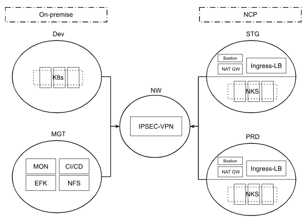
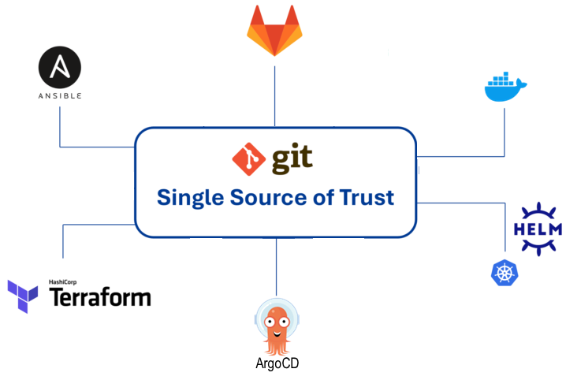
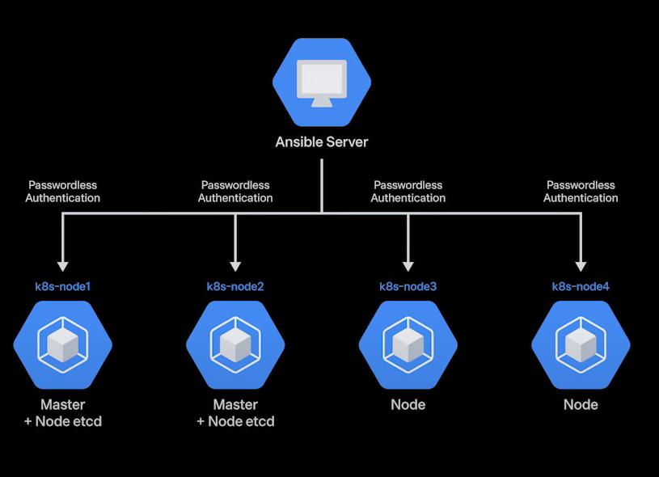
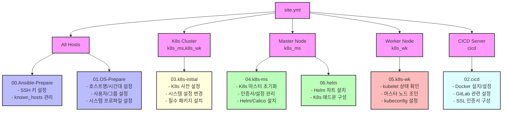

# A사 차세대 IT시스템 구축 POC

## 프로젝트 개요
- **역할**: Technical Architect
- **프로젝트 목표**: 레거시 시스템의 클라우드 네이티브 전환 및 현대화

## 인프라 설계

### 인프라 환경 구성도

### 클러스터 정보

| 구분 |   인프라   |  K8s 설치  | K8s 리소스 배포 | 클러스터 수 |  환경   |
|:----:|:----------:|:----------:|:--------------:|:----------:|:-------:|
| dev  |  Hyper-V   |  Ansible   |  Helm Charts   |     1      | On-prem |
| stg  | Terraform  | Terraform  |  Helm Charts   |     4      |   NCP   |
| prd  | Terraform  | Terraform  |  Helm Charts   |     4      |   NCP   |

## GITOPS 배포 설계

### 배포 환경 구성도

## Ansible 배포

### Ansible 타겟서버 및 Roles

## 기술 스택
### 인프라 환경
- **기반 환경**: Linux, Kubernetes Cluster, NCP
- **인프라 구성**: 하이브리드 클라우드 (온프레미스 + NCP)
- **컨테이너 플랫폼**: 
  - DEV: Kubernetes Native Cluster
  - STG/PRD: NCP NKS
  - 가용성 및 확장성 고려한 멀티 클러스터 설계

### 애플리케이션 현대화
- **AS-IS**: .NET + IIS (Server-based)
- **TO-BE**: Spring Boot + VueJS (Container-based)

### DevOps 도구
- **CI 파이프라인**:
  - 형상관리: GitLab
  - 빌드 자동화: Jenkins
  - 빌드 도구: Gradle, Maven, Jib, NodeJS
  - 컨테이너화: Docker

- **CD 파이프라인**:
  - 배포 도구: ArgoCD
  - 배포 전략: GitOps 기반 멀티 클러스터 통합 배포

### IaC (Infrastructure as Code)
- **OS 구성 관리**: Ansible
- **클라우드 인프라 프로비저닝**: Terraform
- **쿠버네티스 리소스 관리**: Helm Charts

## 주요 업무 및 성과

### 아키텍처 설계
- 하이브리드 클라우드 환경에서의 쿠버네티스 클러스터 아키텍처 설계
- 마이크로서비스 아키텍처 전환을 위한 표준 정의
- 멀티 클러스터 환경에서의 서비스 디스커버리 및 로드밸런싱 설계

### 클라우드 마이그레이션
- 온프레미스 물리 서버에서 컨테이너 기반 클라우드 환경으로 전환
- 워크로드 분석 및 용량 산정
- 클라우드 네이티브 Best Practice 수립 및 적용

### DevOps 환경 구축
- GitOps 기반 CI/CD 파이프라인 구축
- 멀티 클러스터 환경의 통합 배포 자동화
- IaC 기반 인프라 프로비저닝 자동화

## 기술적 도전 과제

### 1. 레거시 애플리케이션 컨테이너화
- .NET 애플리케이션의 Spring Boot 전환 과정에서의 기술적 갭 해결
- 컨테이너 최적화 및 보안 강화
- 무중단 배포 전략 수립

### 2. 멀티 클러스터 운영
- 멀티 클러스터의 효율적 관리를 위한 운영 자동화
- 클러스터 간 네트워크 통신 최적화
- 통합 모니터링 및 로깅 체계 구축

### 3. 하이브리드 클라우드 관리
- 온프레미스와 클라우드 환경의 원활한 통합
- 보안 정책 준수 및 거버넌스 체계 수립
- 비용 최적화 전략 수립

## 프로젝트 산출물
- 클라우드 네이티브 아키텍처 설계서
- 설치결과서
- CI/CD 설계서
- IaC 템플릿 및 자동화 스크립트
- 운영자 메뉴얼 (Hans-On 실습코드 포함)
