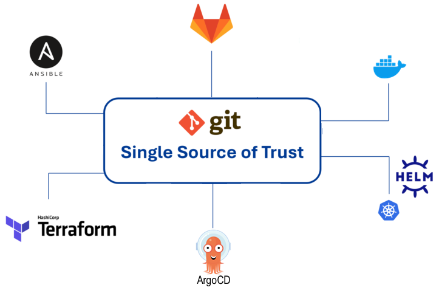
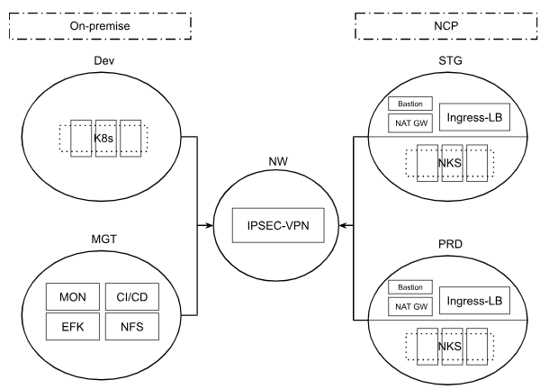
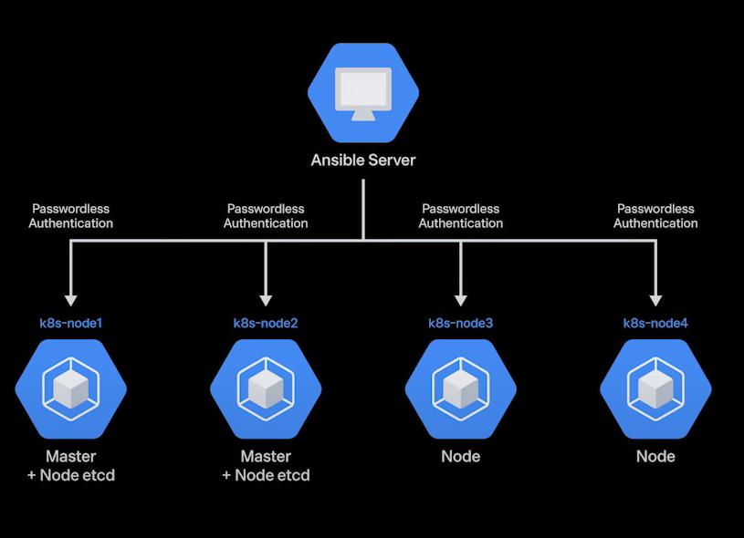
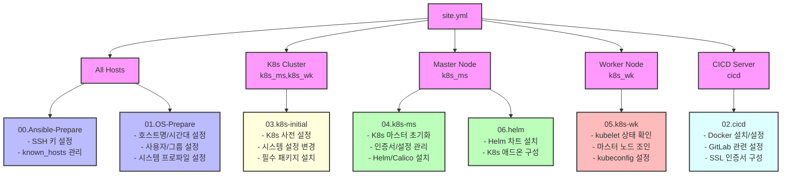

# example

## GITOPS 배포환경 설정

### 배포 환경 구성도

## 인프라 배포. (Terraform : dev, stg, prd )

### 클러스터 정보

| 구분 |   인프라   |  K8s 설치  | K8s 리소스 배포 | 클러스터 수 |  환경   |
|:----:|:----------:|:----------:|:--------------:|:----------:|:-------:|
| dev  |  Hyper-V   |  Ansible   |  Helm Charts   |     1      | On-prem |
| stg  | Terraform  | Terraform  |  Helm Charts   |     4      |   NCP   |
| prd  | Terraform  | Terraform  |  Helm Charts   |     4      |   NCP   |

### 인프라 환경 구성도

### NCP 변수값 설정
    1. variables.tf 파일 수정 (terraform/dev/variables.tf)
    - variable "env" 수정
    - variable "vpc_cidr" 수정

    2. variables.tf 파일 수정 (terraform/stg/variables.tf, terraform/prd/variables.tf)
    - variable "env" 수정
    - variable "vpc_cidr" 수정
    - variable "argocd_password" 수정

## Ansible 배포

### Ansible 타겟서버 및 Roles
