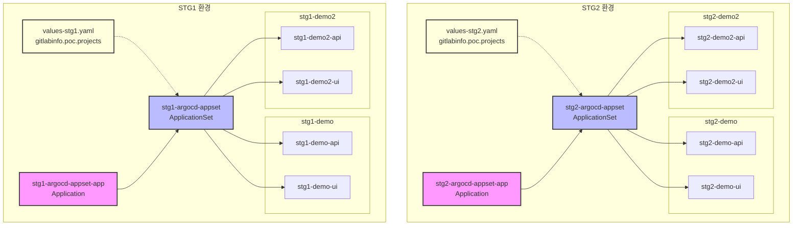
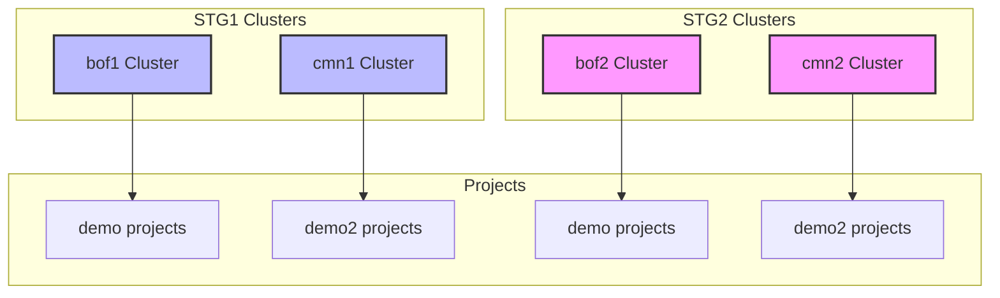
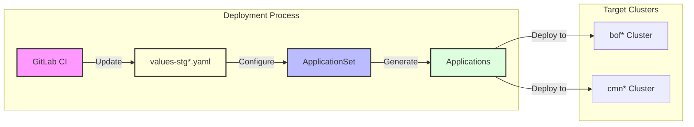
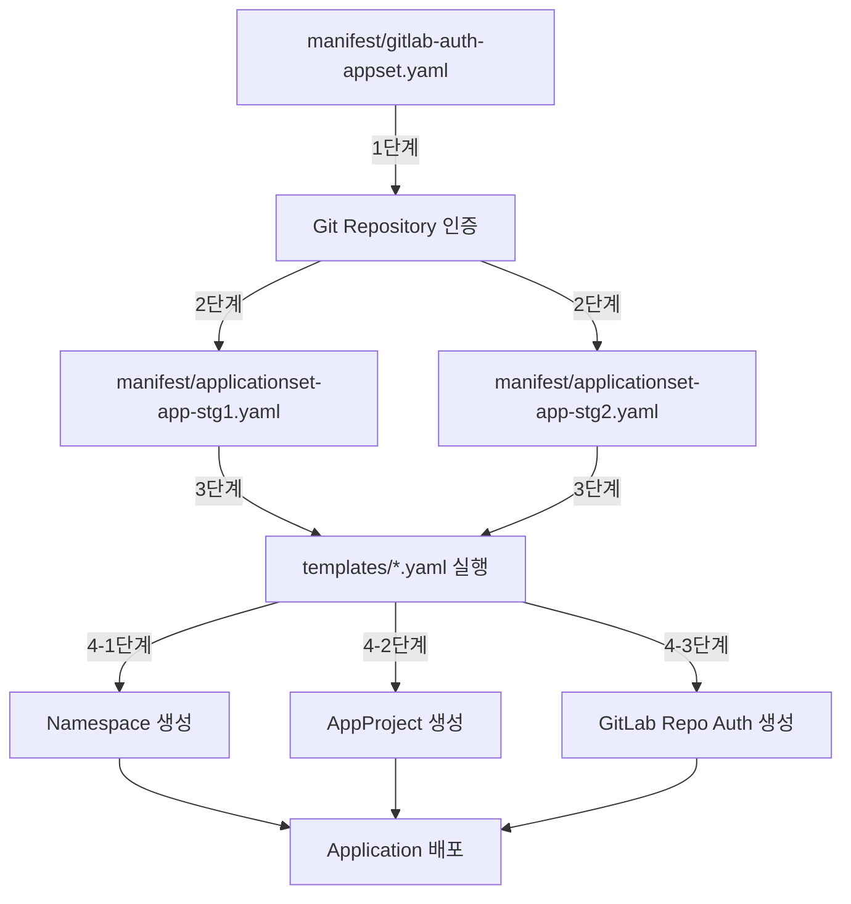

# argocd-appset 프로젝트 운영자 메뉴얼

## ArgoCD ApplicationSet 구성

### 프로젝트 목적
1. ArgoCD를 사용한 GitLab 프로젝트 자동화 배포 관리
   - ApplicationSet을 통한 다중 애플리케이션 배포 자동화
   - GitLab 프로젝트 정보 자동 수집 및 관리

2. GitOps 기반 배포 자동화 구성
   - GitLab CI를 통한 자동 설정 업데이트
   - ApplicationSet을 통한 자동 배포 관리
   - 프로젝트별 독립된 네임스페이스 관리

3. 보안 및 권한 관리
   - GitLab 저장소 인증 정보 관리
   - 프로젝트별 독립된 인증 정보 관리
   - 환경별 접근 권한 관리

### ArgoCD 애플리케이션 구성도









### 주요 구성요소

| 구성요소 | 설명 |
|----------|------|
| stg1-argocd-appset-app | - stg-argocd-appset 저장소를 관리하는 메인 Application<br/>- values-stg1.yaml을 사용하여 설정 값 적용<br/>- ApplicationSet 컨트롤러를 생성/관리 |
| stg2-argocd-appset-app | - stg-argocd-appset 저장소를 관리하는 메인 Application<br/>- values-stg2.yaml을 사용하여 설정 값 적용<br/>- ApplicationSet 컨트롤러를 생성/관리 |
| stg1-argocd-appset | - ApplicationSet 정의<br/>- poc 그룹의 프로젝트들을 자동으로 Application으로 생성<br/>- values-stg1.yaml의 gitlabinfo.poc.projects 정보 기반 동작<br/>- bof1 클러스터 대상 배포 |
| stg2-argocd-appset | - ApplicationSet 정의<br/>- poc 그룹의 프로젝트들을 자동으로 Application으로 생성<br/>- values-stg2.yaml의 gitlabinfo.poc.projects 정보 기반 동작<br/>- bof2 클러스터 대상 배포 |
| Generated Applications | - ApplicationSet에 의해 자동 생성되는 Applications<br/>- 프로젝트별 독립된 네임스페이스에 배포<br/>- stg 브랜치 기준 자동 동기화<br/>- 클러스터별 분리 배포 (bof/cmn) |

1. **GitLab CI (.gitlab-ci.yml)**
   - GitLab API를 통한 자동화된 데이터 수집
     - 그룹 및 프로젝트 정보 자동 수집
     - stg 브랜치 존재 여부 확인
   - values-stg1.yaml, values-stg2.yaml 자동 업데이트
     - 프로젝트 정보 동기화
     - 브랜치 정보 관리
   - 스케줄 기반 실행
     - 주기적인 프로젝트 정보 갱신
     - 웹 훅을 통한 수동 실행 지원

2. **Values 설정 (values-stg1.yaml, values-stg2.yaml)**
   - 환경 설정
     - 기본 환경: stg1, stg2
     - ArgoCD 네임스페이스: argocd
   - GitLab 연동 설정
     - API 엔드포인트
     - 인증 정보 (username, token)
     - SSL 검증 설정
   - 클러스터 설정
     - bof1/bof2: 비즈니스 클러스터
     - cmn1/cmn2: 공통 클러스터
   - 프로젝트 그룹 정보
     - poc 그룹 프로젝트 관리
     - 프로젝트별 메타데이터 관리
       - ID, 이름, URL
       - 기본 브랜치
       - 네임스페이스
       - 클러스터 구분 (description)

3. **ApplicationSet 관리**
   ```mermaid
   graph TD
       A[ApplicationSet Controller] -->|생성| B[Application Template]
       B -->|적용| C[Generated Applications]
       C -->|배포| D[Kubernetes Resources]
       
       subgraph "Template 구성"
           B -->|설정| E[Metadata]
           B -->|설정| F[Spec]
           F -->|포함| G[Source]
           F -->|포함| H[Destination]
           F -->|포함| I[SyncPolicy]
       end

       style A fill:#f9f,stroke:#333,stroke-width:2px
       style B fill:#bbf,stroke:#333,stroke-width:2px
       style C fill:#dfd,stroke:#333,stroke-width:2px
       style D fill:#ffd,stroke:#333,stroke-width:2px
   ```

4. **보안 및 권한 관리**
   | 구성 요소 | 설명 |
   |----------|------|
   | GitLab 인증 | - API 토큰 기반 인증<br>- SSL 인증서 검증 설정 |
   | Kubernetes 권한 | - 네임스페이스별 격리<br>- 클러스터별 접근 제어 |
   | ArgoCD 권한 | - 프로젝트별 권한 관리<br>- 자동 동기화 정책 설정 |
   | 리소스 보호 | - PrunePropagationPolicy 설정<br>- 자동 복구 정책 적용 |

5. **동기화 정책**
   - 자동화된 동기화
     ```yaml
     syncPolicy:
       automated:
         prune: true      # 불필요한 리소스 자동 제거
         selfHeal: true   # 변경사항 자동 복구
         allowEmpty: true # 빈 디렉토리 허용
     ```
   - 동기화 옵션
     - ServerSideApply: 서버 사이드 적용
     - PrunePropagationPolicy: 리소스 정리 정책
     - PruneLast: 삭제 순서 제어

### 배포 자동화 특징

1. 네임스페이스 관리
   - 프로젝트별 독립된 네임스페이스 자동 생성
   - 환경별(dev, stg, prd) 네임스페이스 분리

2. 동기화 정책
   - 자동 동기화 (automated sync)
   - 프루닝 (리소스 자동 정리)
   - 자동 복구 (self-healing)

3. 설정 관리
   - Helm 차트 기반 배포 설정
   - 환경별 values 파일 분리
   - GitLab 프로젝트 정보 자동 업데이트

### AppProject 템플릿 구성

1. **네임스페이스 및 프로젝트 자동 생성**
   ```mermaid
   graph TD
       subgraph "STG2 환경"
           V2[values-stg2.yaml<br/>gitlabinfo.poc.projects] --> T2[AppProject Template]
           T2 --> N2[Namespace 생성]
           T2 --> P2[AppProject 생성]
           
           subgraph "템플릿 생성 결과"
               N2 --> NS3[stg2-demo<br/>Namespace bof2]
               N2 --> NS4[stg2-demo2<br/>Namespace cmn2]
               P2 --> AP3[stg2-demo<br/>AppProject]
               P2 --> AP4[stg2-demo2<br/>AppProject]
           end
       end
       subgraph "STG1 환경"
           V1[values-stg1.yaml<br/>gitlabinfo.poc.projects] --> T1[AppProject Template]
           T1 --> N1[Namespace 생성]
           T1 --> P1[AppProject 생성]
           
           subgraph "템플릿 생성 결과"
               N1 --> NS1[stg1-demo<br/>Namespace bof1]
               N1 --> NS2[stg1-demo2<br/>Namespace cmn1]
               P1 --> AP1[stg1-demo<br/>AppProject]
               P1 --> AP2[stg1-demo2<br/>AppProject]
           end
       end
       style T1 fill:#bbf,stroke:#333,stroke-width:2px
       style T2 fill:#bbf,stroke:#333,stroke-width:2px
       style V1 fill:#ffd,stroke:#333,stroke-width:2px
       style V2 fill:#ffd,stroke:#333,stroke-width:2px
   ```

2. **AppProject 주요 설정**
   | 구성 요소 | 설명 |
   |----------|------|
   | sourceRepos | - 모든 Git 저장소 허용 ('*')<br>- 프로젝트별 소스 코드 접근 권한 |
   | destinations | - 네임스페이스별 배포 대상 지정<br>- 기본 쿠버네티스 클러스터 사용 |
   | clusterResourceWhitelist | - Namespace 리소스 생성 권한<br>- 프로젝트별 리소스 제어 |
   | roles | - 네임스페이스별 역할 정의<br>- GitLab 그룹 기반 권한 매핑 |

3. **동기화 옵션**
   ```yaml
   annotations:
     argocd.argoproj.io/sync-options: Prune=false
     argocd.argoproj.io/compare-options: IgnoreExtraneous
   ```
   - Prune=false: 리소스 자동 삭제 방지
   - IgnoreExtraneous: 외부 변경사항 무시

4. **권한 관리**
   - 프로젝트별 역할 자동 생성
   - GitLab 그룹과 역할 매핑
   - 네임스페이스별 접근 제어
   - Application 조회 및 동기화 권한 설정

## STG Application 배포

### 0. 프로젝트 Cloning

> **⚠️ 주의**: 이 프로젝트는 독립적인 디렉토리에 복제되어야 합니다.

프로젝트를 로컬 환경에 복제합니다:

```bash
# 프로젝트 클론
git clone https://git-poc.example.co.kr/platform/stg-argocd-appset.git

# 디렉토리 이동
cd stg-argocd-appset

# 브랜치 확인
git branch
```

디렉토리 구조:
```
stg-argocd-appset/
├── Chart.yaml
├── README.md
├── manifest/
│   ├── applicationset-app-stg1.yaml
│   ├── applicationset-app-stg2.yaml
│   └── gitlab-auth-appset.yaml
├── templates/
│   ├── applicationset-poc.yaml
│   ├── argocd-appproject-template.yaml
│   └── gitlabREPO-auth-template.yaml
├── values-stg1.yaml
└── values-stg2.yaml
```

### 1. Git 저장소 인증 설정

ArgoCD가 Git 저장소에 접근할 수 있도록 인증 정보를 설정합니다:

```bash
# GitLab 인증 시크릿 생성
kubectl apply -f manifest/gitlab-auth-appset.yaml
```

### 2. STG1, STG2 ApplicationSet App 배포

Git 인증 설정 후, 각 환경의 ApplicationSet을 관리할 메인 Application을 배포합니다:

```bash
# STG1 ApplicationSet App 배포
kubectl apply -f manifest/applicationset-app-stg1.yaml

# STG2 ApplicationSet App 배포
kubectl apply -f manifest/applicationset-app-stg2.yaml
```

### 3. 배포 확인

- ArgoCD 콘솔에서 배포 확인 : 
http://argocd.example.co.kr/

### 4. Application Pruning (애플리케이션 제거)

애플리케이션을 ArgoCD에서 제거하는 방법은 두 가지가 있습니다:

1. **센터별 일괄 Pruning**
   - 센터(STG1/STG2) 전체 애플리케이션을 한 번에 제거
   ```bash
   # STG1 환경의 모든 애플리케이션 제거
   kubectl delete applications -n argocd stg1-argocd-appset-app
   kubectl delete applicationsets.argoproj.io -n argocd stg1-argocd-appset

   # STG2 환경의 모든 애플리케이션 제거
   kubectl delete applications -n argocd stg2-argocd-appset-app
   kubectl delete applicationsets.argoproj.io -n argocd stg2-argocd-appset
   ```

2. **개별 애플리케이션 Pruning**
   - values 파일에서 특정 프로젝트 정보를 제거하여 선택적 제거
   ```yaml
   # values-stg1.yaml 또는 values-stg2.yaml 수정
   gitlabinfo:
     poc:
       projects:
         # 제거하고자 하는 프로젝트 항목을 삭제
         # 예: demo2-api, demo2-ui 프로젝트 제거
         - id: 16
           name: ui
           url: https://git-poc.example.co.kr/poc/demo/ui.git
           default_branch: dev
           namespace_name: demo
           empty_repo: false
           description: bof
         - id: 15
           name: api
           url: https://git-poc.example.co.kr/poc/demo/api.git
           default_branch: dev
           namespace_name: demo
           empty_repo: false
           description: bof
   ```

3. **Pruning 후 정리 작업**
   ```bash
   # 제거된 애플리케이션의 네임스페이스 정리
   kubectl delete namespace stg1-demo2  # 예: STG1의 demo2 네임스페이스 제거
   kubectl delete namespace stg2-demo2  # 예: STG2의 demo2 네임스페이스 제거

   # AppProject 정리
   kubectl delete appproject -n argocd stg1-demo2  # 예: STG1의 demo2 프로젝트 제거
   kubectl delete appproject -n argocd stg2-demo2  # 예: STG2의 demo2 프로젝트 제거
   ```

> **⚠️ 주의사항**
> - Application을 제거하기 전에 반드시 백업을 확인하세요.
> - Pruning 작업은 되돌릴 수 없으므로 신중하게 진행하세요.
> - 네임스페이스 제거 시 포함된 모든 리소스가 함께 제거됩니다.
> - values 파일 수정 후에는 GitLab CI 파이프라인이 자동으로 실행되어 변경사항이 적용됩니다.