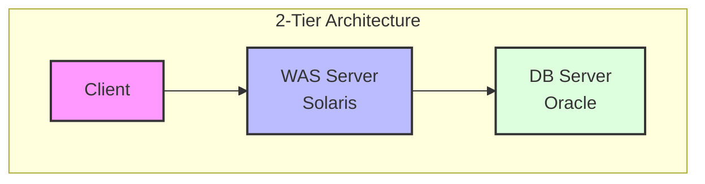
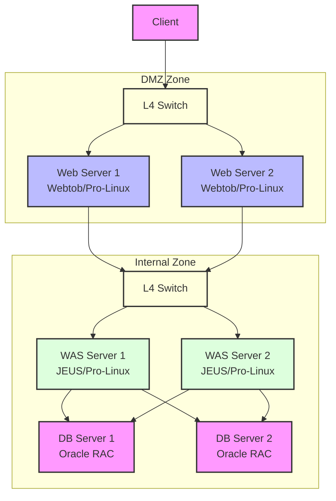

# 공공기관 정보시스템 현대화 프로젝트

## 프로젝트 개요
- **역할**: Technical Architect
- **프로젝트 목표**: 레거시 시스템 현대화 및 아키텍처 개선
- **기간**: 2023~2024년

## 인프라 설계

### 인프라 환경 구성도

#### AS-IS 구성

#### TO-BE 구성

### 시스템 아키텍처 현대화
- **AS-IS**: 
  - 2-Tier 아키텍처 (WAS-DB)
  -  물리서버 기반 Solaris 운영체제

- **TO-BE**: 
  - 3-Tier 아키텍처 (Web-WAS-DB)
  - 가상화 기반 Pro-Linux 운영체제
  - DMZ/내부망 분리

### 인프라 구성
- **웹 서버 (WEB)**:
  - Active-Active 구성
  - Webtob 기반
  - DMZ 영역 배치

- **애플리케이션 서버 (WAS)**:
  - Active-Active 구성
  - JEUS 미들웨어
  - 내부 시스템 영역 배치

- **데이터베이스 서버 (DB)**:
  - Active-Active 구성
  - Oracle DBMS
  - 내부 시스템 영역 배치

## 주요 업무 및 성과

### U2L 마이그레이션
- Solaris에서 Pro-Linux로 OS 전환
- 시스템 안정성 및 성능 개선
- TCO 절감

### 아키텍처 개선
- 2-Tier에서 3-Tier로 아키텍처 현대화
- DMZ와 내부망 분리로 보안성 강화
- Active-Active 구성으로 가용성 향상

### 시스템 업그레이드
- OS 업그레이드 및 최적화
- Webtob/JEUS 미들웨어 업그레이드
- Oracle 및 3rd Party S/W 업그레이드

## 기술 스택

### 인프라 환경
- **운영체제**: Pro-Linux
- **웹서버**: Webtob
- **WAS**: JEUS
- **DBMS**: Oracle

### 아키텍처 구성
- **네트워크 구성**: DMZ/내부망 분리
- **가용성**: Active-Active 구성
- **보안**: DMZ 기반 망분리

## 프로젝트 산출물
- 인프라 아키텍처 설계서
- U2L 마이그레이션 계획서
- 시스템 구성도
- 운영 매뉴얼

## 주요 기술적 도전 과제

### 1. U2L 마이그레이션
- Solaris 특화 기능의 Linux 호환성 확보
- 무중단 마이그레이션 전략 수립
- 성능 최적화 및 튜닝

### 2. 3-Tier 전환
- 기존 2-Tier 애플리케이션의 분리
- 세션 관리 및 로드밸런싱 구현
- 시스템 간 연계 구성

### 3. 보안 강화
- DMZ 구축 및 망분리 적용
- 구간별 접근 통제 정책 수립
- 보안 취약점 제거
