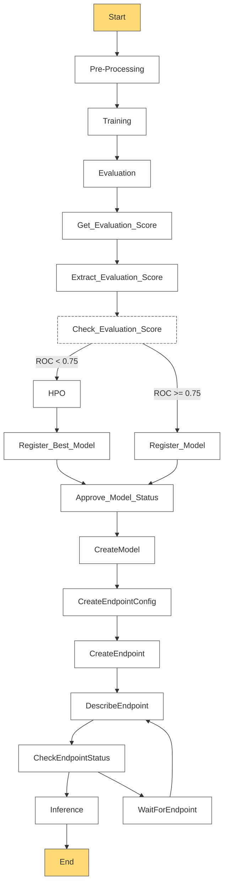

# B사, C사 AI MLOps 플랫폼 구축 프로젝트

## 프로젝트 개요
- **역할**: PM / MLOps
- **프로젝트 목표**: 서버리스 기반 MLOps 플랫폼 구축 및 ML 파이프라인 자동화
- **기간**: 2022년 ~ 2023년

## 인프라 설계

### 인프라 환경 구성도

### 클라우드 환경 구성
| 구분 | 인프라 | MLOps Platform | 모델 서빙 | 환경 |
|:----:|:------:|:-------------:|:---------:|:----:|
| TO-BE  | AWS    | SageMaker / Step Functions | SageMaker Endpoint  | AWS  |
| AS-IS  | On-prem| X    | 수동작업    |On-prem|

## ML 파이프라인 설계

### 모델 빌딩 파이프라인

### 파이프라인 구성요소
- **데이터 전처리**: AWS Lambda
- **모델 학습**: SageMaker Training Job
- **하이퍼파라미터 최적화**: SageMaker HPO
- **모델 평가**: SageMaker Processing Job
- **모델 등록**: SageMaker Model Registry
- **모델 배포**: SageMaker Endpoint / KServe

## 기술 스택

### 클라우드 인프라
- **AWS 서비스**:
  - SageMaker
  - Lambda
  - Step Functions
  - EventBridge
  - S3
  - ECR

### MLOps 도구
- **ML 실험관리**: MLflow
- **파이프라인 오케스트레이션**: AWS Step Functions
- **모델 서빙**: SageMaker Endpoint, KServe
- **모니터링**: CloudWatch, Prometheus

### IaC & 자동화
- **인프라 프로비저닝**: Terraform
- **CI/CD**: GitHub Actions
- **구성 관리**: AWS Systems Manager

## 주요 구현 내용

### 서버리스 ML 파이프라인
- Step Functions 기반 ML 워크플로우 자동화
- 이벤트 기반 파이프라인 트리거 구현
- 하이브리드 클라우드 환경 모델 배포 자동화

### 모델 관리 체계
- 모델 버저닝 및 실험 이력 관리
- 모델 성능 모니터링 및 드리프트 탐지
- A/B 테스트 환경 구축

### 운영 자동화
- 인프라 프로비저닝 자동화
- 모델 재학습 파이프라인 자동화
- 모델 서빙 스케일링 자동화

## 기술적 도전 과제

### 1. MLOps Platform 구축

- SageMaker Studio 기반 통합 개발 환경 구축
- MLflow 기반 실험 관리 시스템 구축
- 모델 레지스트리 및 아티팩트 관리 체계 구축
- CI/CD 파이프라인 자동화 구현
- 보안 정책 준수 및 데이터 거버넌스 체계 수립
- 하이브리드 클라우드 환경의 모델 서빙 아키텍처 구축

### 2. 서버리스 아키텍처 최적화
- Lambda 함수 콜드스타트 최소화
- Step Functions 상태 관리 최적화
- 비용 효율적인 리소스 프로비저닝

### 3. MLOps 자동화
- 파이프라인 오케스트레이션 자동화
- 모델 성능 모니터링 자동화
- 모델 재학습 트리거 자동화

## 프로젝트 산출물
- 클라우드 아키텍처 설계서
- Terraform IaC 템플릿
- ML 파이프라인 워크플로우 정의
- 운영 자동화 스크립트

